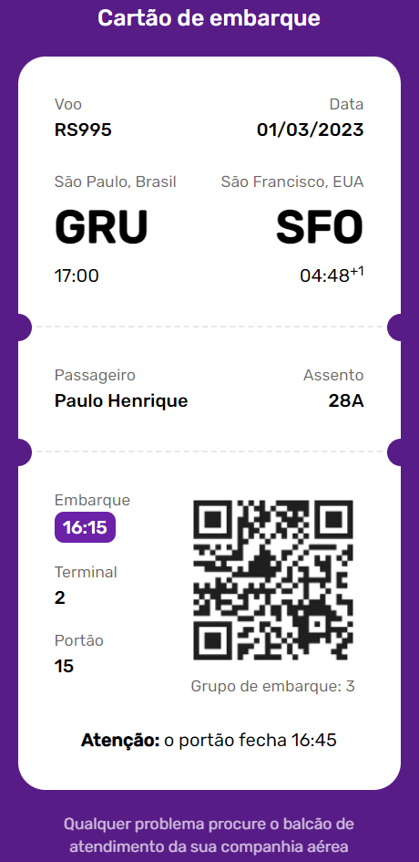

<h1 align="center">🚀Desafio 06 do projeto #boracodar da Rocktseat🚀</h1>

Este projeto consiste em desenvolver um cartão de embarque conforme o modelo do [Figma](https://www.figma.com/community/file/1205146101173113980)

<h2>👩‍💻 Tecnologias</h2>
  
  
  
  

<h2>📱 Projeto</h2>

  

